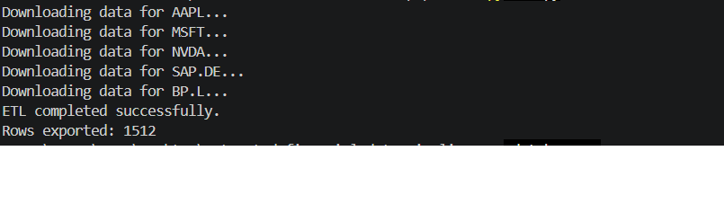
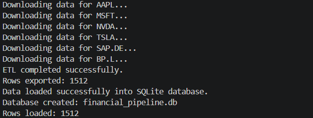
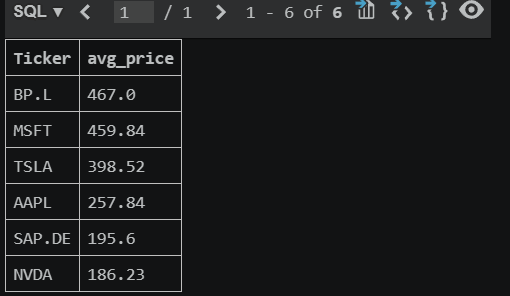
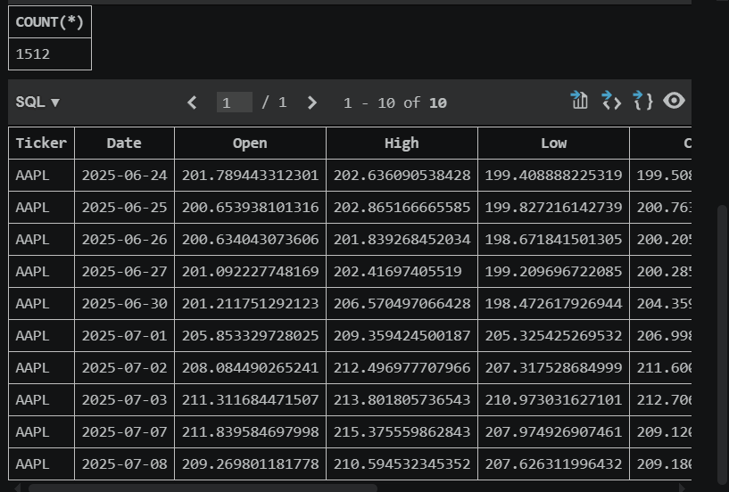
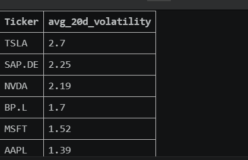

# Automated Financial Data Pipeline

An end-to-end financial data pipeline built with Python, Yahoo Finance, Pandas and SQLite.

## Project Overview

This project extracts stock market data from Yahoo Finance, transforms it using Python and Pandas, loads it into a SQLite database, and prepares analytical SQL queries for business intelligence reporting.

## Pipeline Flow

Yahoo Finance API → Python ETL → CSV Export → SQLite Database → SQL Analytics → Power BI-ready dataset

## Features

- Automated stock market data extraction
- Data cleaning and transformation
- Daily return calculation
- Moving averages calculation
- 20-day volatility calculation
- SQLite database loading
- SQL analytics queries
- Power BI-ready financial dataset

## Technologies

- Python
- Pandas
- Yahoo Finance API
- SQLite
- SQL
- Git
- GitHub

## Screenshots

### ETL Execution

### Data Loaded into SQLite

### Average Stock Price Analysis

### Dataset Preview

### Volatility Analysis

## Author

Cosmin-Gabriel Chiriță